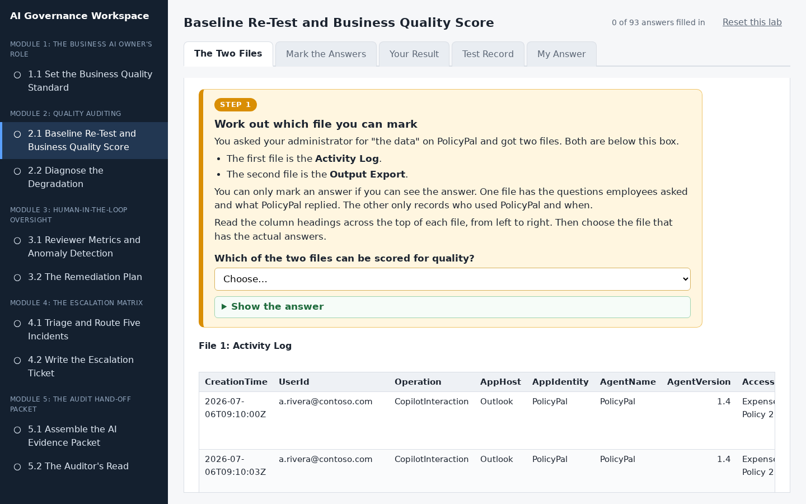
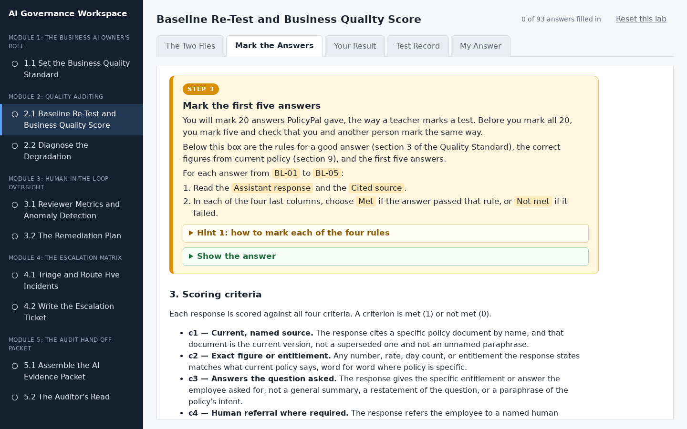
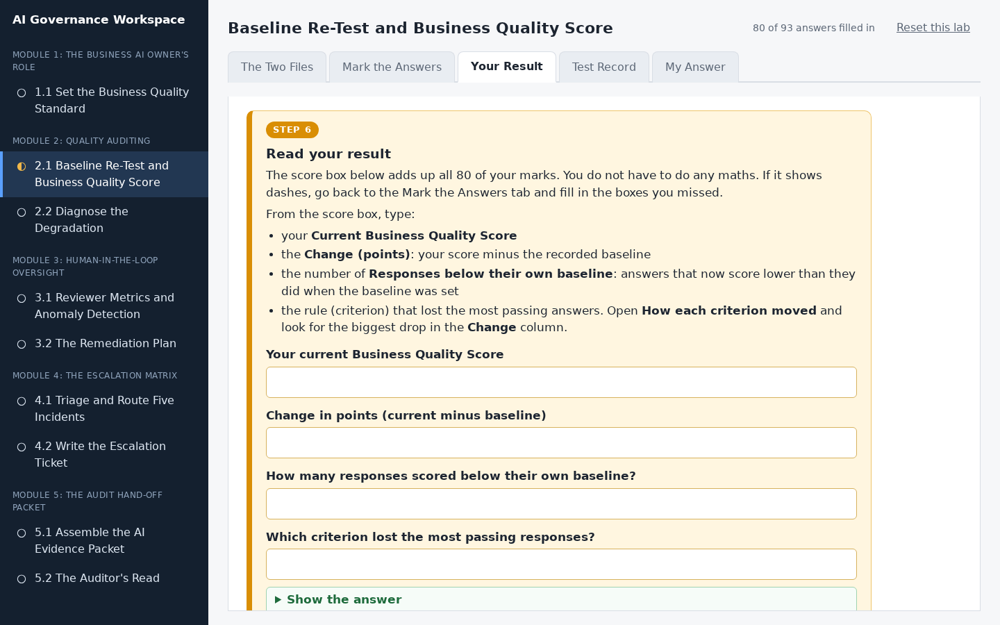
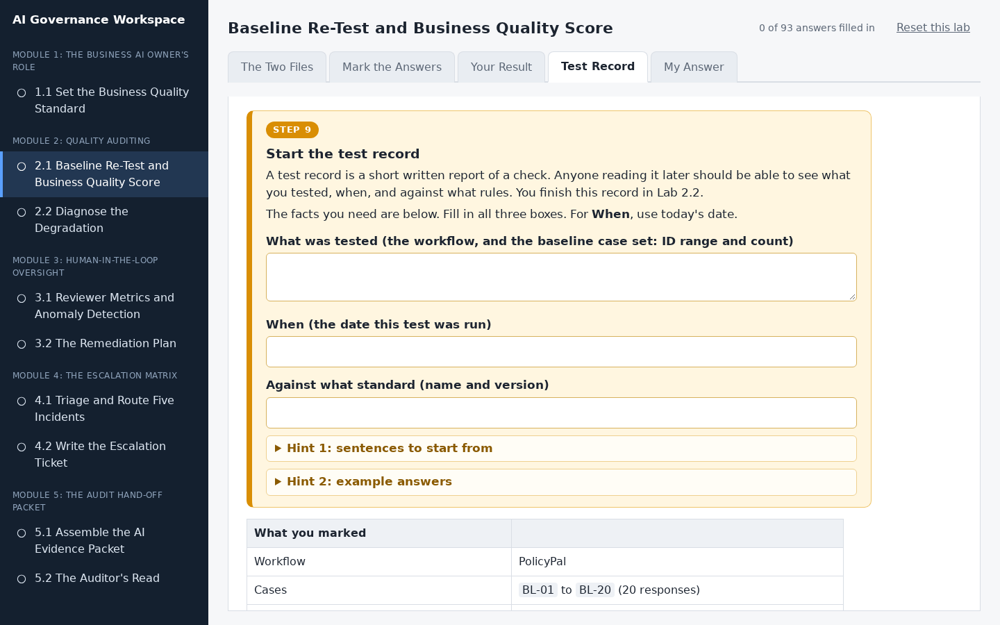
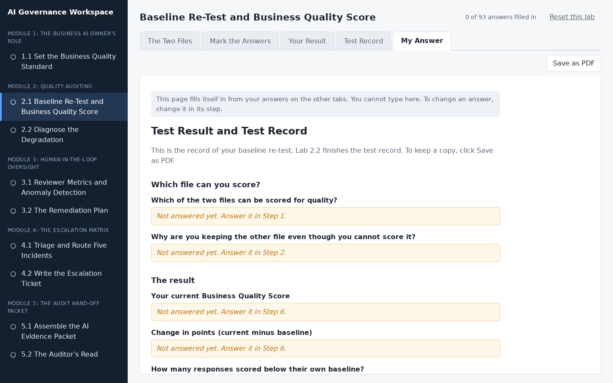

# Baseline Re-Test and Business Quality Score

## Lab Objective

**Score a fixed baseline set of AI responses against a written standard, read the Business Quality Score your scoring produces, and compare it to the recorded baseline to decide whether business quality has degraded.**

This is the periodic control test that turns "we monitor the AI" into evidence. You are handed two exports and first have to work out which one you can actually score. Then you score a 20-response sample against a supplied quality standard, read the single Business Quality Score that results, and compare it to the score the same responses received when the baseline was set. The result is a defensible, documented statement about whether PolicyPal is still doing a good job.

If you ask an administrator for "the audit log," on any platform, expect a spreadsheet of who-did-what-when, not the actual questions and answers. Microsoft Copilot's audit search and its eDiscovery collection are two different requests to two different tools; Claude Enterprise's "Export logs" and "Export Data" are two separate buttons on the same settings page, and only one of each pair has real content. Knowing which one to ask for is the first skill this lab tests.

In this lab, you will:
- Identify which of two platform exports contains scorable content
- Calibrate your scoring against a reference before the full run
- Score 20 responses against four pass/fail criteria
- Read the Business Quality Score your scoring produces
- Compare current scores to a recorded baseline and see how many responses moved
- Check the result against a quality alarm level set in advance
- State whether business quality has degraded, with the numbers to support it

By the end of this lab you will be able to run a baseline re-test on any AI workflow that has a written quality standard.

## In Plain Words

- **What you are doing:** You will mark 20 answers that PolicyPal gave to employees, the way a teacher marks a test. Then you will find out whether PolicyPal is doing worse than it used to.
- **Why it matters:** An AI tool can get worse without anyone noticing. Marking the same kind of answers on a regular schedule is how a company catches that early.
- **You do not have to:** download anything, open a spreadsheet, or do any maths. The workspace adds up the score for you, and everything you type saves by itself.
- **If you feel lost:** in the workspace, every instruction is in a numbered orange box. Do the boxes in order, from the left-most tab to the right-most tab.

**Words you will see in this lab**
- **Business Quality Score:** a score out of 100. It is the share of your pass or fail marks that were passes.
- **Baseline:** the score PolicyPal got when it was first checked. It is the starting point that new scores are compared with.
- **Criteria:** the four things a good answer must do. You mark every answer against all four.
- **Alarm level:** the score at which the company has already decided "something is wrong, so investigate". It is decided before the test, not after.

## Resources

- If you haven't already done so, click the `WEB PORTS` dropdown in your classroom environment. From that menu click `aux1:2224`.
- On the page that opens in your browser, click `2.1 Baseline Re-Test and Business Quality Score` in the left sidebar.
- Then do Step 1 to Step 10 in the workspace. You do not need to keep this page open while you work.

## What You Will Do in the Workspace

Everything you do in this lab happens in the workspace.

- The workspace has five tabs. Start on the left-most tab and work to the right. You never need to go back to a tab you have finished.
- On each tab, work from top to bottom. Every instruction is in an orange box with a step number, from Step 1 to Step 10. Everything outside the orange boxes is the material you need for that step.
- If a step asks you to answer something, the answer box is inside the orange box.
- Stuck? Each orange box has hints you can open, and most have a **Show the answer** button.
- At the bottom of each tab, click **Go to the next tab** when you have finished every step on it.
- Everything you type saves by itself. The counter at the top right shows how many answers you have filled in.

### Tab 1: The Two Files (Steps 1 and 2)

You look at the two files your administrator sent and work out which one you can actually mark. Then you say why you are keeping the other one.

### Tab 2: Mark the Answers (Steps 3 to 5)

You mark 20 of PolicyPal's answers against four rules, choosing Met or Not met for each. You mark the first five, compare them with a partner, then mark the other 15. The rules and the correct policy figures are shown right under each step.

### Tab 3: Your Result (Steps 6 to 8)

The workspace adds up your marks. You read your Business Quality Score, compare it with the recorded baseline and the alarm level set in advance, and write one sentence saying whether quality has got worse.

### Tab 4: Test Record (Steps 9 and 10)

You start a test record: what you tested, when, and against which standard. Then you decide what to do first now that quality has dropped.

### Tab 5: My Answer

You do not type anything here. This tab gathers your answers into one test result. Anything you missed says which step to go back to. Click **Save as PDF** if you want a copy.

## Conclusion

In this lab you determined which export could actually be scored, calibrated your scoring against a reference, ran a fixed baseline set against a written standard, read the Business Quality Score it produced, and measured it against an alarm level set in advance. This is the periodic control test that produces evidence rather than reassurance. You have run it once here, with the standard and the sample supplied; what transfers to a workflow of your own is the method and the completed test record, not this single run.
