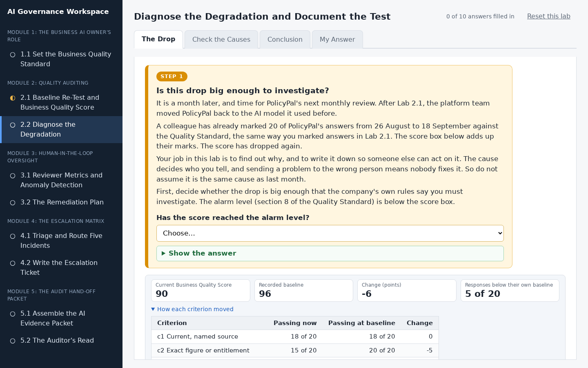
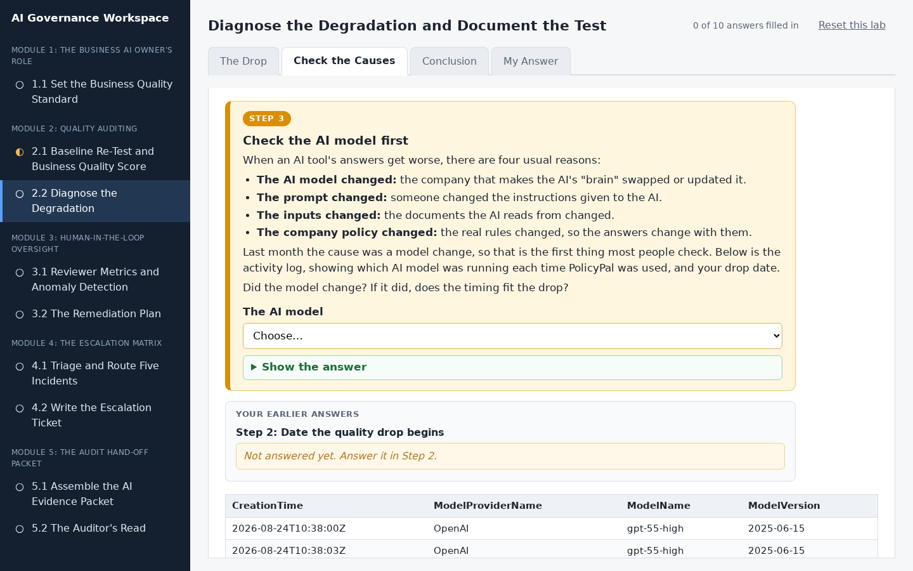
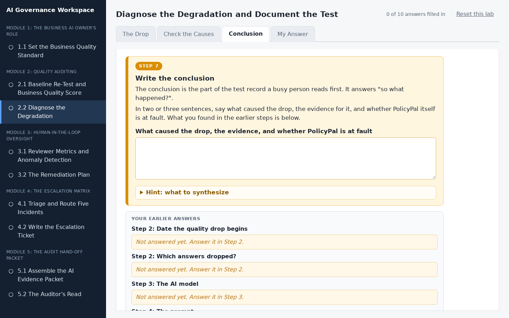
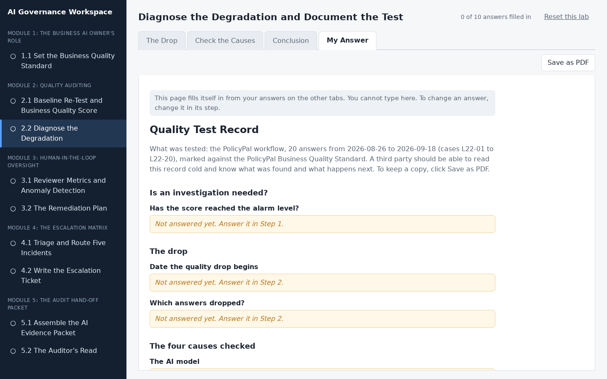
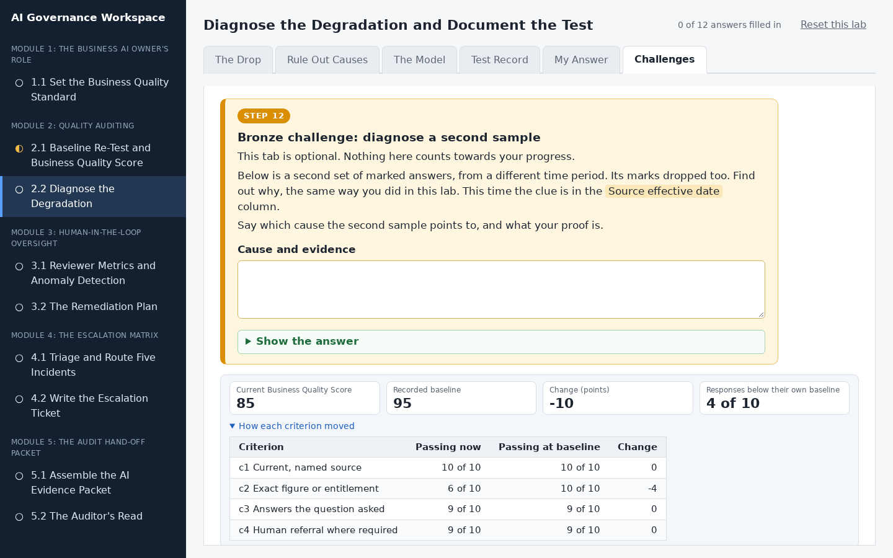

# Diagnose the Degradation and Document the Test

## Lab Objective

**Find the real cause of a drop in AI answer quality by checking all four possible causes, decide whether the AI is actually at fault, and write a test record that sends the finding to the right owner.**

Confirming that quality dropped is only half of an audit. The half that makes it evidence is naming *why* it dropped, with proof, so the right person can act on it. In Lab 2.1 the cause was a change of AI model. This lab is the next month's review: the score is below the alarm floor again, the model has changed again, and it would be easy to blame it a second time. It is not the model this time. You test the drop against all four causes of degradation, find that a company policy changed, and work out that PolicyPal is quoting the new policy correctly: it is the Quality Standard that is out of date.

In this lab, you will:
- Decide whether a drop is big enough to investigate, using the alarm level
- Find when a drop started and which kinds of answer it affects
- Test the drop against the four causes of degradation, and rule the AI model out on timing
- Tell a changed policy apart from a changed input, and decide whether the AI's answers are actually wrong
- Write the conclusion of a test record and send the finding to the right owner

By the end of this lab you will be able to diagnose and document a quality drop in any AI workflow that keeps an activity log, without assuming the cause.

## In Plain Words

- **What you are doing:** PolicyPal's score is below the alarm level again. You will play detective: find when it started, check each possible cause, and work out who needs to hear about it.
- **Why it matters:** The cause decides who can fix it. Blaming the wrong thing sends the problem to people who cannot fix it, and sometimes the AI is not broken at all.
- **You do not have to:** download anything, open a spreadsheet, or do any maths. The workspace does the totals for you, and everything you type saves by itself.
- **If you feel lost:** in the workspace, every instruction is in a numbered orange box. Do the boxes in order, from the left-most tab to the right-most tab.

**Words you will see in this lab**
- **Business Quality Score:** a score out of 100 for how well PolicyPal's answers are doing.
- **Baseline:** the score PolicyPal got when it was first checked. New scores are compared with it.
- **AI model:** the "brain" inside PolicyPal. Another company makes it.
- **Prompt:** the instructions PolicyPal is given.
- **Activity log:** a diary the platform keeps of every time the AI is used, including which model was running and which documents it read.
- **Effective date:** the date a policy starts to apply.
- **Test record:** a short written report of a check: what you tested, what you found, and what happens next.

## Resources

- If you haven't already done so, click the `WEB PORTS` dropdown in your classroom environment. From that menu click `aux1:2224`.
- On the page that opens in your browser, click `2.2 Diagnose the Degradation` in the left sidebar.
- Then do Step 1 to Step 8 in the workspace. You do not need to keep this page open while you work.

## What You Will Do in the Workspace

Everything you do in this lab happens in the workspace.

- The workspace has four tabs. Start on the left-most tab and work to the right. You never need to go back to a tab you have finished.
- On each tab, work from top to bottom. Every instruction is in an orange box with a step number, from Step 1 to Step 8. Everything outside the orange boxes is the material you need for that step.
- If a step asks you to answer something, the answer box is inside the orange box.
- Stuck? Each orange box has hints you can open, and most have a **Show the answer** button.
- At the bottom of each tab, click **Go to the next tab** when you have finished every step on it.
- Most answers are drop-down menus. Everything you type or pick saves by itself. The counter at the top right shows how many answers you have filled in.

### Tab 1: The Drop (Steps 1 and 2)

The answers from the next monthly review have already been marked. You decide whether the drop is big enough to investigate, then find the date it started and which kinds of question it affects.

### Tab 2: Check the Causes (Steps 3 to 6)

You check the four possible causes one at a time, each with its evidence shown under the step. The AI model changed again, but the timing does not fit. Then you decide whether PolicyPal's new answers are really wrong, or whether the Quality Standard is out of date.

### Tab 3: Conclusion (Steps 7 and 8)

You write the conclusion of the test record, then decide who to speak to and what happens next.

### Tab 4: My Answer

You do not type anything here. This tab gathers your answers into one test record. Anything you missed says which step to go back to. Click **Save as PDF** if you want a copy.

<!-- challenge section
NOTE: written for the earlier version of this lab (model-change cause); update before restoring.

### Tab 6: Challenges (optional, Steps 12 to 14)

Three extra challenges for anyone who finishes early:

- **Bronze:** diagnose a second marked sample from a different period.
- **Silver:** find a second change hiding in the activity log.
- **Gold:** write your finding as a five-sentence note for people who are not technical.
end challenge section -->

## Conclusion

In this lab you confirmed that a drop in the Business Quality Score was big enough to investigate, found when it started and what it affected, and tested it against all four causes of degradation instead of assuming last month's answer. The model had changed, but the timing ruled it out; the real cause was a new company policy, and PolicyPal was quoting it correctly. A drop in the score does not always mean the AI is broken. Sometimes it means the yardstick needs updating, and the finding goes to the policy owner, not the platform team.
