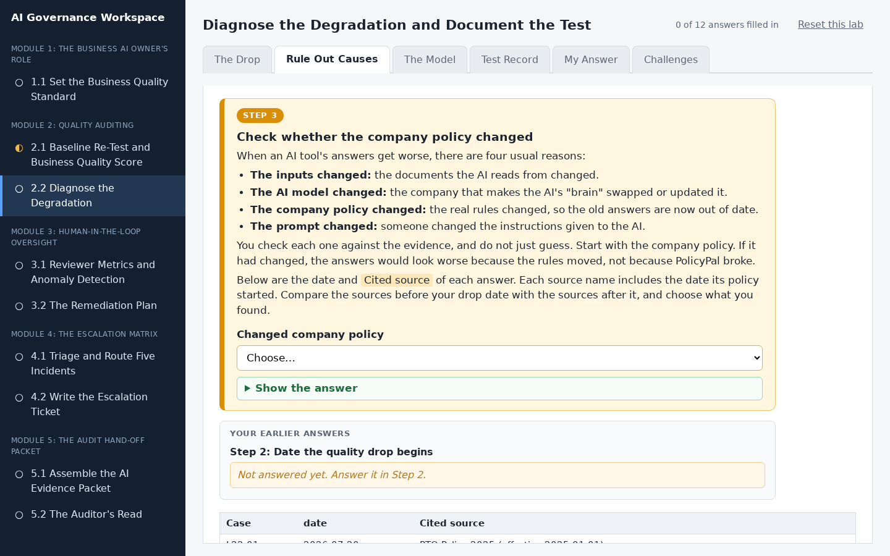
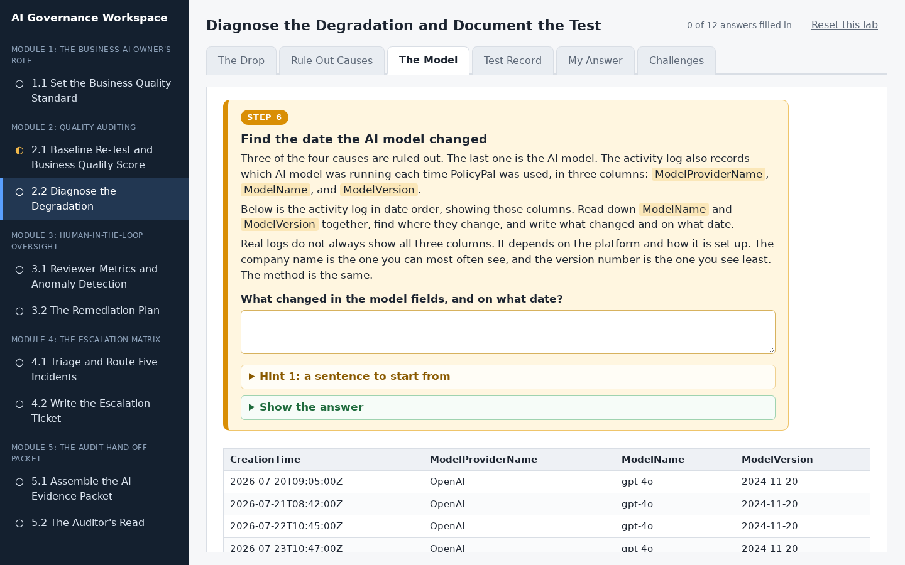
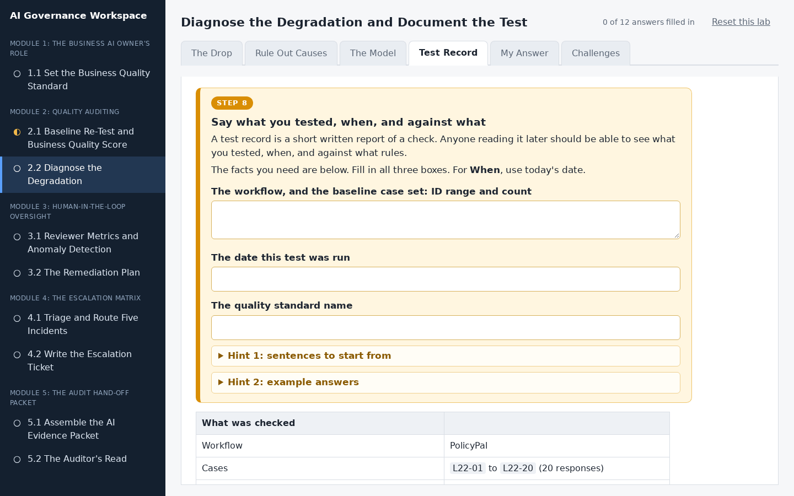
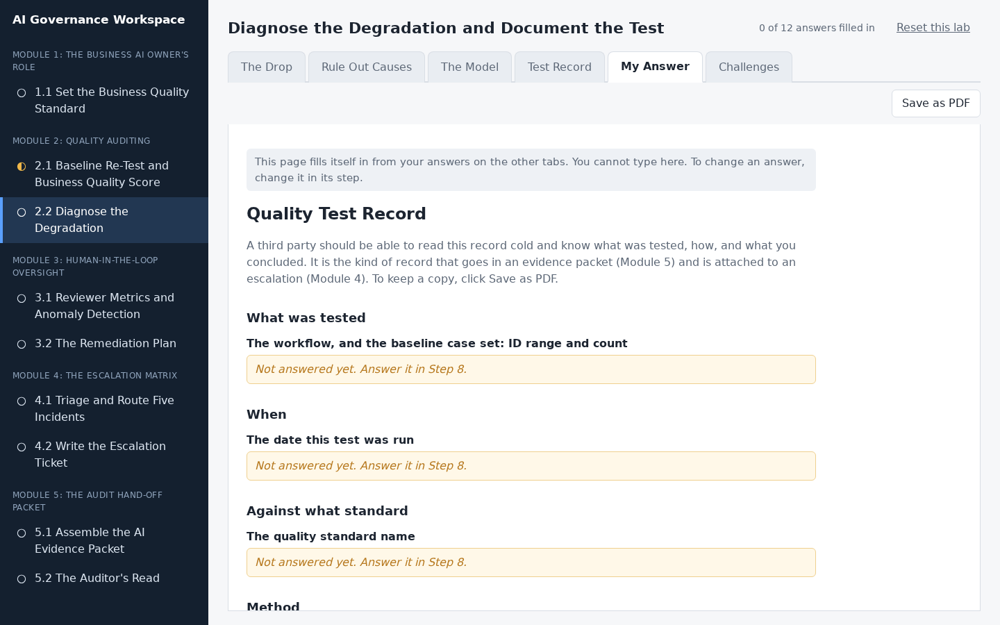

# Diagnose the Degradation and Document the Test

## Lab Objective

**Find the cause of a confirmed drop in AI output quality, cite the evidence that proves it, and complete a test record a third party could act on.**

Confirming that quality dropped is only half of an audit. The half that makes it evidence is naming *why* it dropped and writing it down so someone who was not there can act on it. In this lab you receive a PolicyPal sample that has already been scored and has clearly degraded, plus the platform activity log for the same period. You test the drop against the four known causes of degradation, identify the real one, cite the exact column that proves it, and complete a test record.

In this lab, you will:
- Confirm a Business Quality Score drop and locate when it happened
- Test a quality drop against the four causes of degradation
- Identify a vendor model change from an activity log and cite the proof
- Complete a test record with method, result, and conclusion

By the end of this lab you will be able to diagnose and document a quality regression in any AI workflow that keeps an activity log.

## In Plain Words

- **What you are doing:** PolicyPal's answers have got worse. You will play detective. You will work out when it started, what caused it, and then write it up.
- **Why it matters:** You cannot fix a problem until you know what caused it. And the people who can fix it will want proof before they act.
- **You do not have to:** download anything, open a spreadsheet, or do any maths. The workspace does the totals for you, and everything you type saves by itself.
- **If you feel lost:** in the workspace, every instruction is in a numbered orange box. Do the boxes in order, from the left-most tab to the right-most tab.

**Words you will see in this lab**
- **Business Quality Score:** a score out of 100 for how well PolicyPal's answers are doing.
- **Baseline:** the score PolicyPal got when it was first checked. New scores are compared with it.
- **AI model:** the "brain" inside PolicyPal. Another company makes it.
- **Vendor:** a company you buy something from. Here, the vendor is the company that makes the AI model.
- **Activity log:** a diary the platform keeps of every time the AI is used.
- **Test record:** a short written report of a check: what you tested, how, and what you found.

## Resources

- If you haven't already done so, click the `WEB PORTS` dropdown in your classroom environment. From that menu click `aux1:2224`.
- On the page that opens in your browser, click `2.2 Diagnose the Degradation` in the left sidebar.
- Then do Step 1 to Step 11 in the workspace. You do not need to keep this page open while you work.

## What You Will Do in the Workspace

Everything you do in this lab happens in the workspace.

- The workspace has six tabs. Start on the left-most tab and work to the right. You never need to go back to a tab you have finished.
- On each tab, work from top to bottom. Every instruction is in an orange box with a step number, from Step 1 to Step 11. Everything outside the orange boxes is the material you need for that step.
- If a step asks you to answer something, the answer box is inside the orange box.
- Stuck? Each orange box has hints you can open, and most have a **Show the answer** button.
- At the bottom of each tab, click **Go to the next tab** when you have finished every step on it.
- Everything you type saves by itself. The counter at the top right shows how many answers you have filled in.
- The last tab, Challenges, is optional. It does not count towards the counter.

### Tab 1: The Drop (Steps 1 and 2)

The answers have already been marked for you. You confirm from the score box that quality really dropped, then find the date the marks started to fall.

### Tab 2: Rule Out Causes (Steps 3 to 5)

There are four usual reasons an AI tool gets worse. You rule out three of them, one step each, using the column of evidence shown under the step: the cited policies, the version of PolicyPal's instructions, and the documents PolicyPal read.

### Tab 3: The Model (Steps 6 and 7)

You find the date the AI model changed in the platform's activity log, compare it with the date the marks dropped, and write down the cause with its proof.

### Tab 4: Test Record (Steps 8 to 11)

You write up the test so someone who was not there can act on it: what you tested, how, what the numbers were, and what you concluded.

### Tab 5: My Answer

You do not type anything here. This tab gathers your answers into one test record. Anything you missed says which step to go back to. Click **Save as PDF** if you want a copy.

### Tab 6: Challenges (optional, Steps 12 to 14)

Three extra challenges for anyone who finishes early:

- **Bronze:** diagnose a second marked sample from a different period.
- **Silver:** find a second change hiding in the activity log.
- **Gold:** write your finding as a five-sentence note for people who are not technical.

## Conclusion

In this lab you confirmed a drop in Business Quality Score, located the date it began, tested it against the four causes of degradation, identified an unannounced vendor model change from the activity log, and wrote a test record another person could act on. That record is both evidence for the audit packet and the basis for an escalation.
