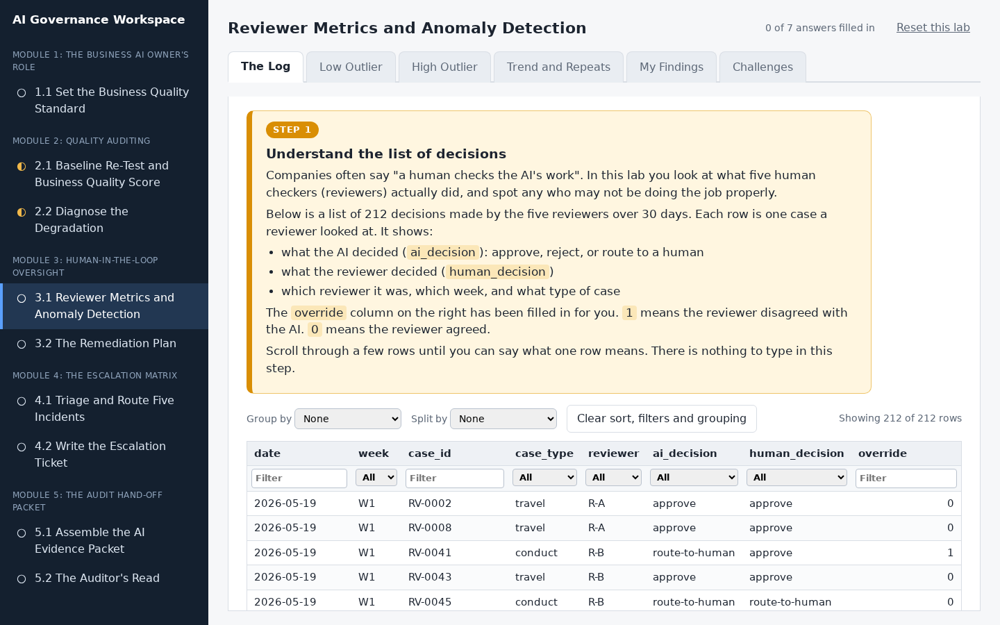
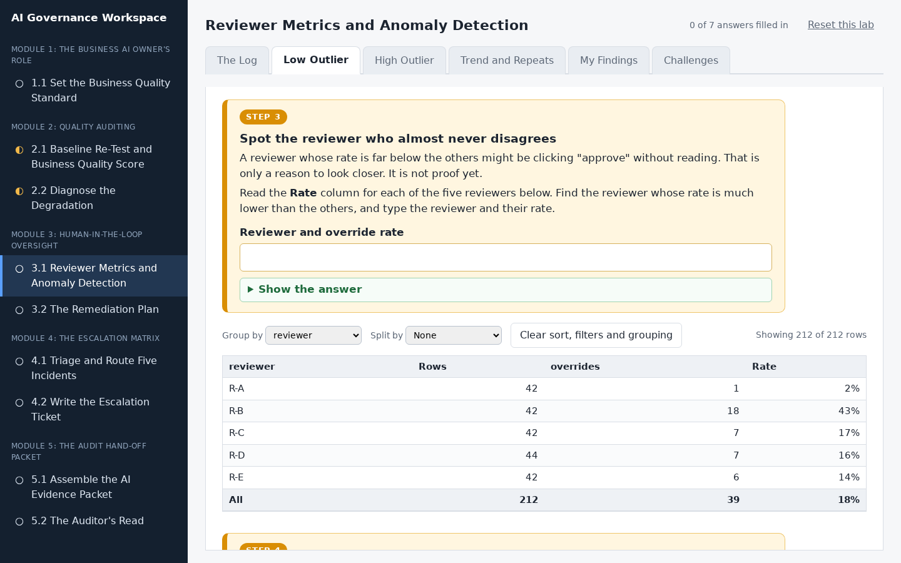
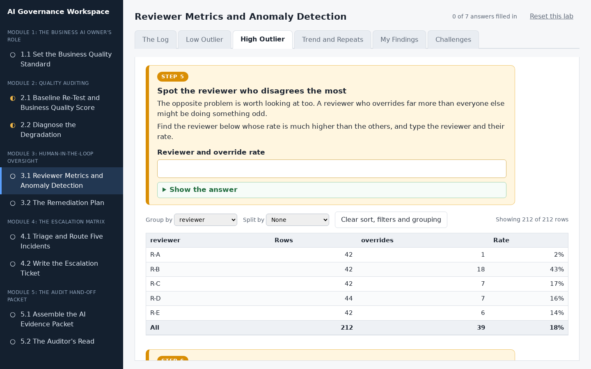
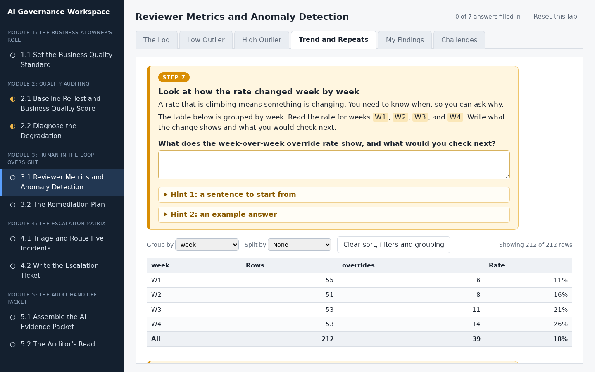
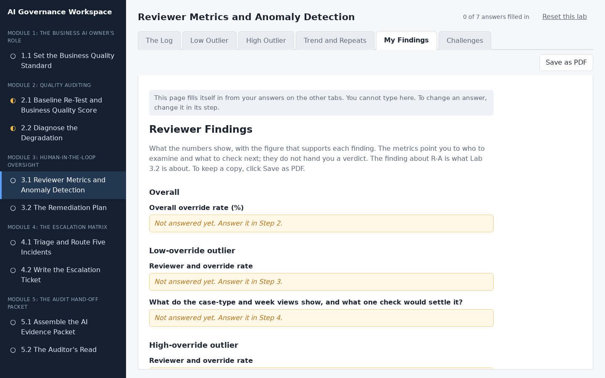
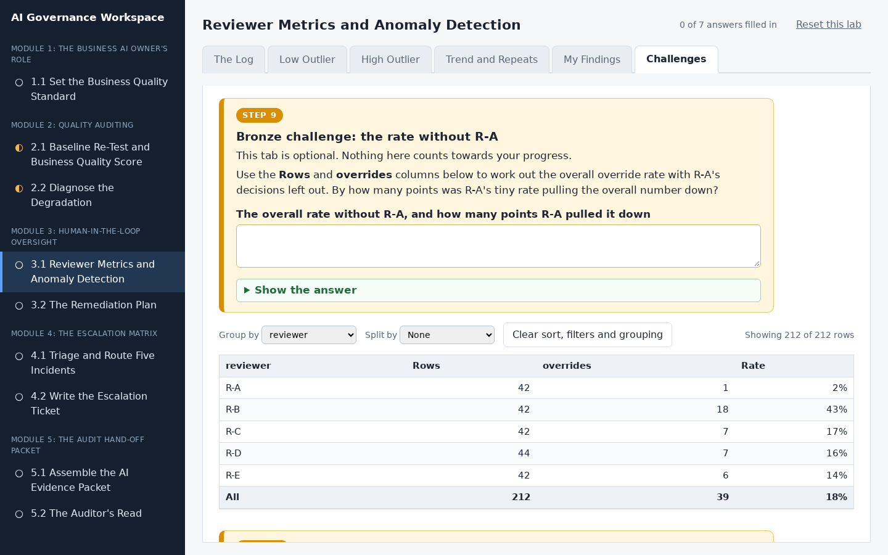

# Reviewer Metrics and Anomaly Detection

## Lab Objective

**Read human-oversight metrics from a reviewer decision log and flag the reviewers whose patterns warrant a closer look.**

Human review is a control, and controls need monitoring. A reviewer who approves everything gives you the appearance of oversight with none of the substance. In this lab you take a 30-day log of human review decisions on PolicyPal, read the overall agreement and override rates, then cut those numbers by reviewer, by case type, and by week. The anomalies only become visible once the numbers are broken down, and that breakdown is the skill.

In this lab, you will:
- Read the overall agreement and override rates
- Break override rates down by reviewer, case type, and week
- Flag a reviewer whose override rate is anomalously low and one whose rate is anomalously high, and test each read before naming it
- Read a week-over-week override trend
- Check seeded duplicate cases for reviewer consistency

By the end of this lab you will be able to audit whether human oversight of an AI workflow is real.

## In Plain Words

- **What you are doing:** Companies often say "a human checks the AI's work". You will look at a list of what five human checkers actually did, and spot any who may not be doing the job properly.
- **Why it matters:** A human check only protects anyone if the human is really checking. Someone who clicks "approve" on everything makes it look safe when it is not.
- **You do not have to:** download anything, open a spreadsheet, or do any maths. The workspace adds up the numbers when you ask, and everything you type saves by itself.
- **If you feel lost:** in the workspace, every instruction is in a numbered orange box. Do the boxes in order, from the left-most tab to the right-most tab.

**Words you will see in this lab**
- **Reviewer:** a person who checks the AI's work.
- **Override:** when a reviewer disagrees with the AI and does something different. Overriding is normal. A reviewer who never does it is suspicious.
- **Override rate:** out of every 100 decisions, how many the reviewer changed. It is shown as a percentage.
- **Outlier:** someone whose numbers are far away from everyone else's.
- **Duplicate case:** the same case, secretly given to the same reviewer twice on different days, to see whether they decide it the same way both times.

## Resources

- If you haven't already done so, click the `WEB PORTS` dropdown in your classroom environment. From that menu click `aux1:2224`.
- On the page that opens in your browser, click `3.1 Reviewer Metrics and Anomaly Detection` in the left sidebar.
- Then do Step 1 to Step 8 in the workspace. You do not need to keep this page open while you work.

## What You Will Do in the Workspace

Everything you do in this lab happens in the workspace.

- The workspace has six tabs. Start on the left-most tab and work to the right. You never need to go back to a tab you have finished.
- On each tab, work from top to bottom. Every instruction is in an orange box with a step number, from Step 1 to Step 8. Everything outside the orange boxes is the material you need for that step.
- If a step asks you to answer something, the answer box is inside the orange box.
- Stuck? Each orange box has hints you can open, and most have a **Show the answer** button.
- At the bottom of each tab, click **Go to the next tab** when you have finished every step on it.
- Everything you type saves by itself. The counter at the top right shows how many answers you have filled in.
- Every table opens already grouped the way its step needs. You can still change the **Group by** and **Split by** menus to explore.
- The last tab, Challenges, is optional. It does not count towards the counter.

### Tab 1: The Log (Steps 1 and 2)

You learn what one row of the reviewer log means, then read the overall override rate: how often the reviewers disagree with the AI.

### Tab 2: Low Outlier (Steps 3 and 4)

You spot the reviewer who almost never disagrees with the AI, then check whether they simply had an easy pile of cases before you write it up.

### Tab 3: High Outlier (Steps 5 and 6)

You spot the reviewer who disagrees the most, then check whether it is the reviewer or the AI that is different.

### Tab 4: Trend and Repeats (Steps 7 and 8)

You read how the override rate changed week by week. Then you check the secret repeat cases, where the same case was given to the same reviewer twice, to see who decided a case two different ways.

### Tab 5: My Findings

You do not type anything here. This tab gathers your answers into one set of findings. Anything you missed says which step to go back to. Click **Save as PDF** if you want a copy.

### Tab 6: Challenges (optional, Steps 9 to 11)

Three extra challenges for anyone who finishes early:

- **Bronze:** work out the overall rate with R-A left out.
- **Silver:** find the reviewer whose own rate is climbing week by week.
- **Gold:** suggest one number to watch every week that would have shown the rise earlier.

## Conclusion

In this lab you read agreement and override rates, cut them by reviewer and by week, flagged two reviewers whose rates warrant a closer look and one whose duplicate-case decisions were inconsistent, and read a rising override trend as a signal to cross-check output quality. The metrics point you to who to examine and what to check next; they do not hand you a verdict. This is how you check whether human oversight of an AI workflow is doing real work.
