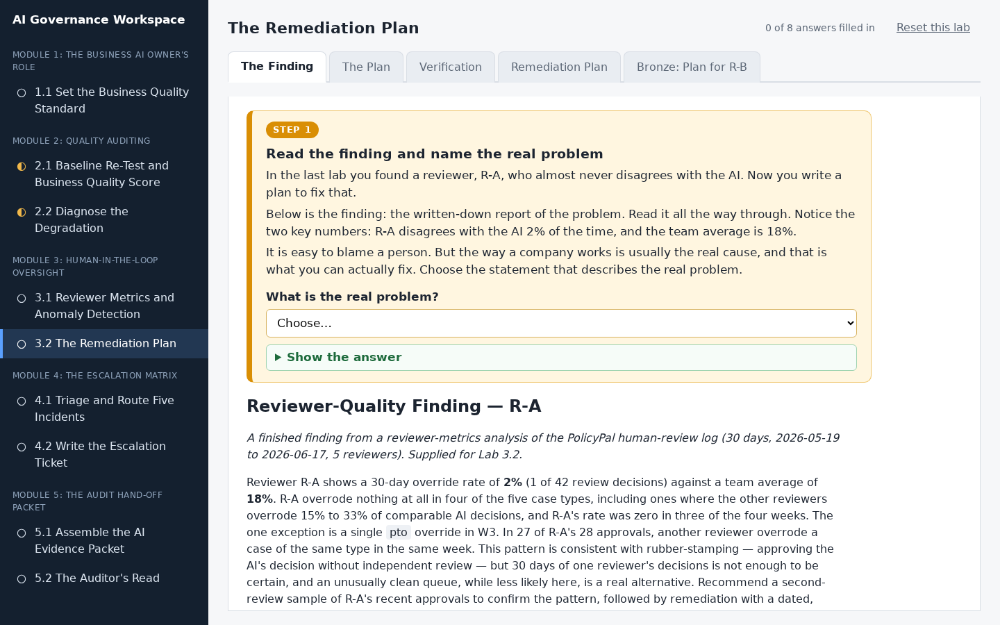
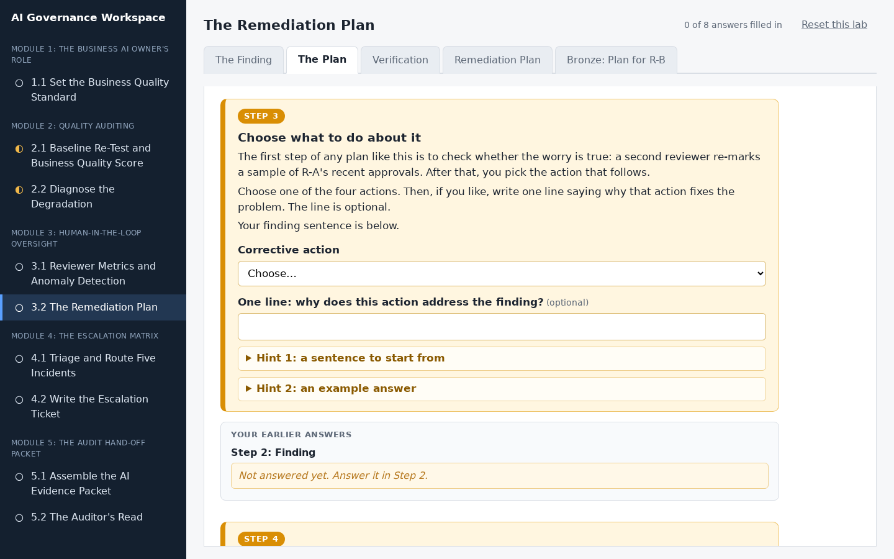
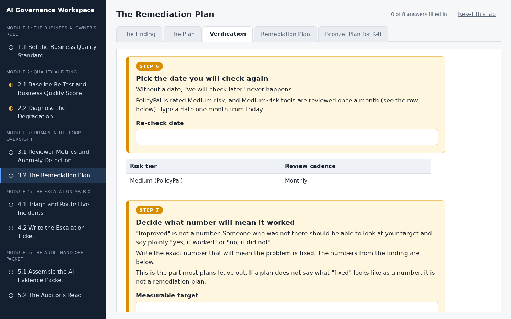
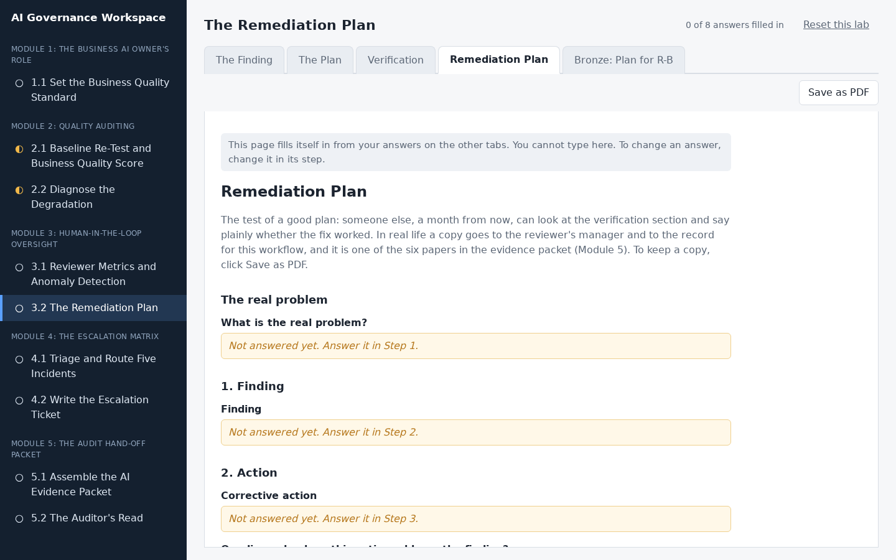
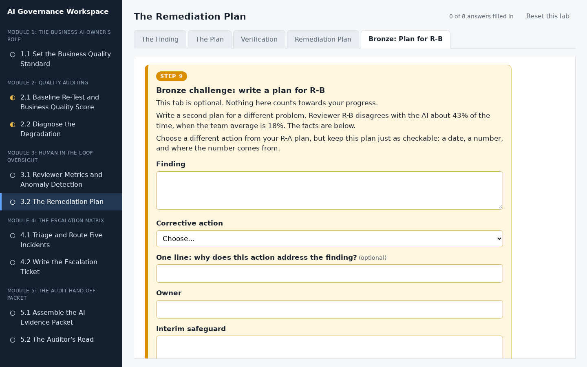

# The Remediation Plan

## Lab Objective

**Turn a reviewer-quality finding into a remediation plan with a dated, measurable test of whether the fix worked.**

Most remediation plans name a problem and an intention and stop there, which leaves no way to tell later whether anything improved. In this lab you take a finding about a reviewer whose approvals may not be receiving independent review and write a plan that names the finding, the corrective action, the responsible owner, and (the part that is usually missing) a re-check date and a measurable target. The plan you produce is one of the six components of the Module 5 evidence packet.

In this lab, you will:
- Restate a finding as a process gap rather than a personal failing
- Choose a corrective action and justify it
- Assign an owner by responsibility
- Define a re-check date, a measurable target, and the evidence the re-check will use

By the end of this lab you will be able to write a remediation plan an auditor would accept.

## In Plain Words

- **What you are doing:** In the last lab you found a reviewer, R-A, who almost never disagrees with the AI. Now you will write a plan to fix that.
- **Why it matters:** A plan that only says "we will do better" is worth nothing, because nobody can tell later whether it worked. A good plan says who will do what, by when, and what number will show that it worked.
- **You do not have to:** download anything, open a spreadsheet, or do any maths. Everything you need is in the workspace, and everything you type saves by itself.
- **If you feel lost:** in the workspace, every instruction is in a numbered orange box. Do the boxes in order, from the left-most tab to the right-most tab.

**Words you will see in this lab**
- **Finding:** a problem that has been discovered and written down.
- **Remediation plan:** a plan to fix a problem. "Remediate" means "fix".
- **Owner:** the person or team responsible for getting the job done. You name them by their job, for example "the team that runs the reviewers", and not by a person's name.
- **Interim safeguard:** a temporary protection that stays in place until the real fix is finished.
- **Measurable target:** a number that shows whether the fix worked. For example, "R-A's rate is back within 5 points of the team average".
- **Auditor:** a person whose job is to check that a company really did what it says it did.

## Resources

- If you haven't already done so, click the `WEB PORTS` dropdown in your classroom environment. From that menu click `aux1:2224`.
- On the page that opens in your browser, click `3.2 The Remediation Plan` in the left sidebar.
- Then do Step 1 to Step 8 in the workspace. You do not need to keep this page open while you work.

## What You Will Do in the Workspace

Everything you do in this lab happens in the workspace.

- The workspace has five tabs. Start on the left-most tab and work to the right. You never need to go back to a tab you have finished.
- On each tab, work from top to bottom. Every instruction is in an orange box with a step number, from Step 1 to Step 8. Everything outside the orange boxes is the material you need for that step.
- If a step asks you to answer something, the answer box is inside the orange box.
- Stuck? Each orange box has hints you can open, and most have a **Show the answer** button.
- At the bottom of each tab, click **Go to the next tab** when you have finished every step on it.
- Everything you type saves by itself. The counter at the top right shows how many answers you have filled in.
- The last tab, Bronze: Plan for R-B, is optional. It does not count towards the counter.

### Tab 1: The Finding (Steps 1 and 2)

You read the finding about reviewer R-A, decide what the real problem is, and restate it in one sentence as a gap in the process rather than a fault in one person.

### Tab 2: The Plan (Steps 3 to 5)

You choose a corrective action, name the owner by the job they do, and add a temporary protection that covers the gap until the fix is in place.

### Tab 3: Verification (Steps 6 to 8)

You set a date to check again, the exact number that will mean the fix worked, and the data that number will come from. This is the part most plans leave out.

### Tab 4: Remediation Plan

You do not type anything here. This tab gathers your answers into one remediation plan. Anything you missed says which step to go back to. Click **Save as PDF** if you want a copy.

### Tab 5: Bronze: Plan for R-B (optional, Step 9)

An extra challenge for anyone who finishes early: write a second plan, for reviewer R-B, who disagrees with the AI far more than everyone else.

## Conclusion

In this lab you turned a reviewer-quality finding into a plan that names the finding, the action, the responsible owner, and a dated, measurable test of whether it worked. That last part is what auditors look for and what most remediation plans lack.
