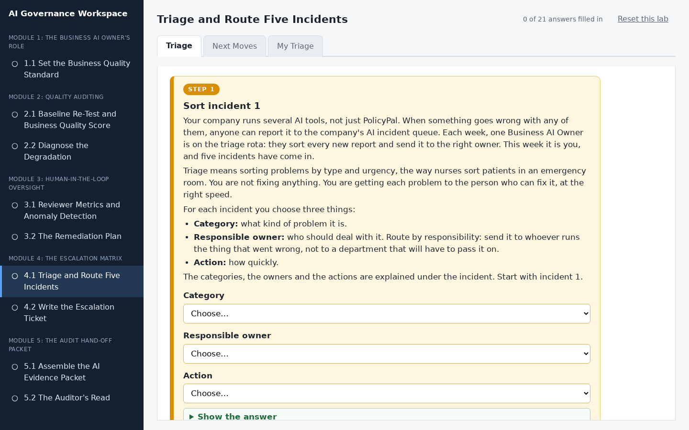
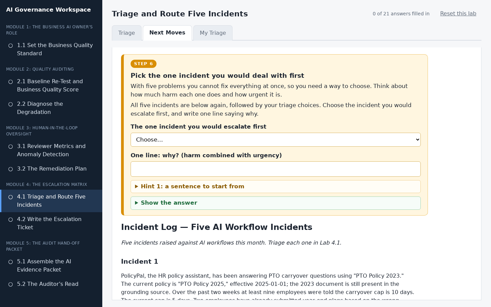
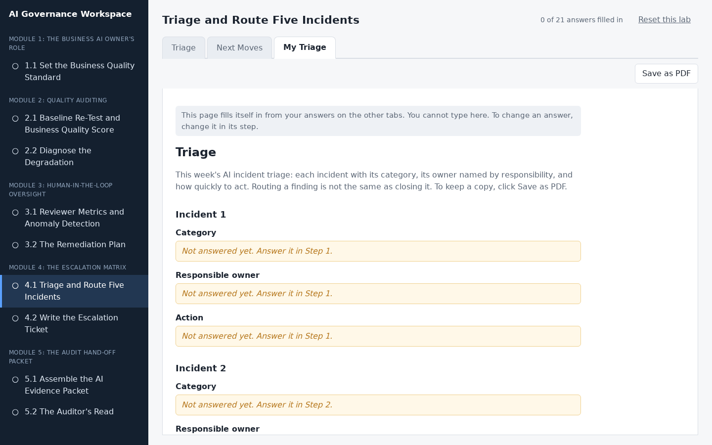

# Triage and Route Five Incidents

## Lab Objective

**Classify five AI workflow incidents by category and route each one to a responsible owner named by responsibility, not by department.**

Your company runs several AI tools, and this week you are on the triage rota for the company's AI incident queue. You cannot fix everything an AI workflow throws at you, and trying to is its own failure. The first move is always triage: what kind of incident is this, who is responsible for the affected thing, and does it even meet the bar to escalate right now. In this lab you work five realistic incidents, including one that is genuinely ambiguous between two categories and one where the right answer may be "monitor, do not escalate yet."

In this lab, you will:
- Assign each incident one of the five incident categories
- Route each incident to a responsible owner named by responsibility rather than by org-chart title
- Resolve an incident that fits two categories by deciding which risk matters more
- Decide whether a low-signal incident meets the bar to escalate now
- Decide the next move when an owner does not respond
- Produce a five-row triage of your own

By the end of this lab you will be able to triage an AI incident into a category and a route in a few minutes.

## In Plain Words

- **What you are doing:** Five different things have gone wrong with AI tools. For each one you will decide what kind of problem it is, who should deal with it, and how quickly.
- **Why it matters:** You cannot fix everything yourself, and you should not try. The skill is to quickly get each problem to the right person. Getting it wrong wastes time, or leaves a serious problem sitting.
- **You do not have to:** download anything, open a spreadsheet, or write long answers. Nearly everything is a drop-down menu, and everything you pick saves by itself.
- **If you feel lost:** in the workspace, every instruction is in a numbered orange box. Do the boxes in order, from the left-most tab to the right-most tab.

**Words you will see in this lab**
- **Incident:** something that went wrong.
- **Triage:** sorting problems by type and urgency, the way nurses sort patients in an emergency room.
- **Escalate:** pass a problem to someone who has the power to fix it.
- **Owner by responsibility:** you name the job that is responsible, for example "the team that owns the policy documents", and you do not name a department, because departments do not tell you who actually does the work.
- **The five categories:**
  - **Business rule:** the AI broke a rule the business set for it.
  - **Business content:** the material the AI reads from is wrong, missing, or out of date.
  - **Security or privacy:** private data was shown, leaked, or misused.
  - **Technical or vendor:** the computer system, the AI model, the connections, or the speed.
  - **Risk or compliance:** the company could get into legal, regulatory, or money trouble.

## Resources

- If you haven't already done so, click the `WEB PORTS` dropdown in your classroom environment. From that menu click `aux1:2224`.
- On the page that opens in your browser, click `4.1 Triage and Route Five Incidents` in the left sidebar.
- Then do Step 1 to Step 7 in the workspace. You do not need to keep this page open while you work.

## What You Will Do in the Workspace

Everything you do in this lab happens in the workspace.

- The workspace has three tabs. Start on the left-most tab and work to the right. You never need to go back to a tab you have finished.
- On each tab, work from top to bottom. Every instruction is in an orange box with a step number, from Step 1 to Step 7. Everything outside the orange boxes is the material you need for that step.
- If a step asks you to answer something, the answer box is inside the orange box.
- Stuck? Each orange box has hints you can open, and most have a **Show the answer** button.
- At the bottom of each tab, click **Go to the next tab** when you have finished every step on it.
- Nearly every answer is a drop-down menu. Everything you pick saves by itself. The counter at the top right shows how many answers you have filled in.

### Tab 1: Triage (Steps 1 to 5)

One step per incident. Each step shows its incident, then the five categories, what each possible owner is responsible for, and what each action means. For each incident you choose the category, the owner named by responsibility, and how quickly to act. Incident 4 fits two categories, and one incident may not need escalating yet.

### Tab 2: Next Moves (Steps 6 and 7)

You pick the one incident you would deal with first, then decide what to do when an owner you escalated to does not reply.

### Tab 3: My Triage

You do not type anything here. This tab gathers your answers into one triage sheet. Anything you missed says which step to go back to. Click **Save as PDF** if you want a copy.

## Conclusion

In this lab you triaged five AI incidents into categories, routed each to a responsible owner by responsibility rather than by department, resolved an ambiguous case by deciding which risk mattered more, separated an escalation from a monitor-and-log item, and decided what to do when an owner does not respond. Triage is the first thing you do with any finding an AI workflow produces, and routing a finding is not the same as closing it.
