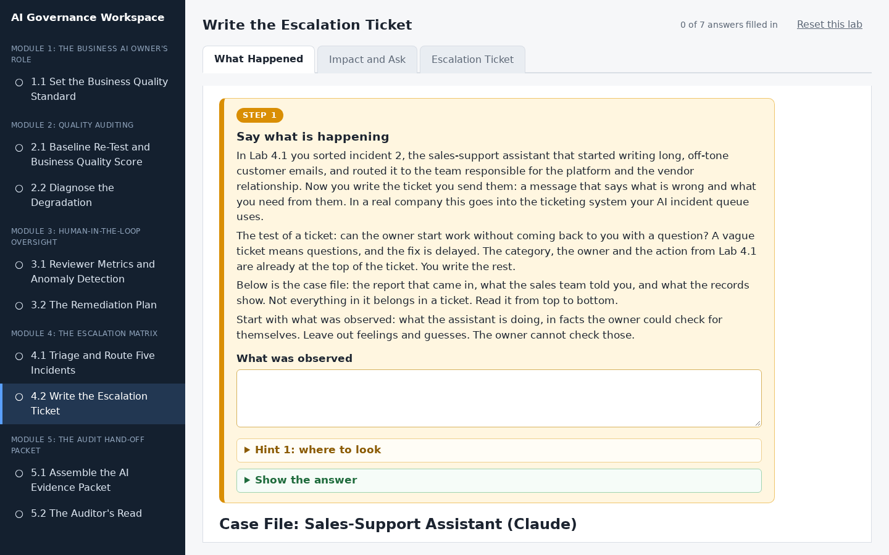
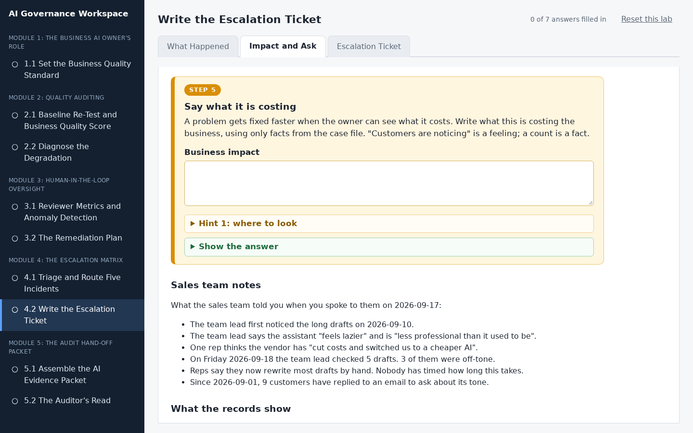
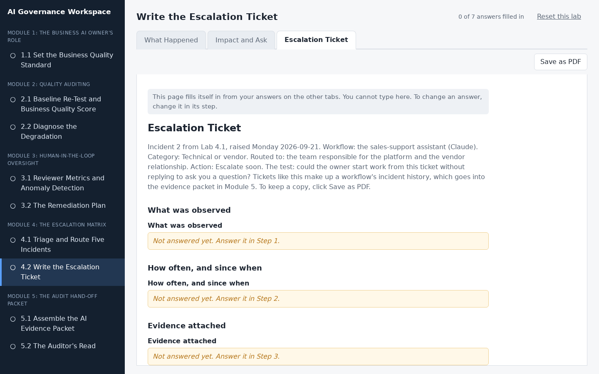

# Write the Escalation Ticket

## Lab Objective

**Write an escalation ticket that gives a responsible owner everything they need to act.**

Escalations fail in practice by describing a feeling instead of a frequency. "The assistant seems worse" is not a ticket. In Lab 4.1 you triaged a sales-support assistant that started writing long, off-tone customer emails, and routed it to the platform team. In this lab you write that team the ticket: what was observed, how often and since when, the proof, what you have ruled out, what it is costing the business, the specific thing you are asking for, and when you need a reply. The case file you work from mixes checkable facts with feelings and guesses, and part of the job is telling them apart.

In this lab, you will:
- State what was observed as facts the owner can check, not feelings or guesses
- Choose the frequency that gives a fair picture, starting from when the problem began
- Choose the evidence that lets the owner check every claim
- Say what you have ruled out, and how you know
- Make one specific ask the owner can act on, with a response-by date that matches the urgency

By the end of this lab you will be able to write an escalation an owner can act on without coming back to you with questions.

## In Plain Words

- **What you are doing:** In Lab 4.1 you sorted a problem and decided who has to fix it. Now you write them a message that tells them what is wrong and what you need from them.
- **Why it matters:** If your message is vague, the other person has to come back with questions, and the fix is delayed. A good message means they can start work straight away.
- **You do not have to:** download anything, open a spreadsheet, or make anything up. Every fact you need is in the case file shown under each step, and everything you type saves by itself.
- **If you feel lost:** in the workspace, every instruction is in a numbered orange box. Do the boxes in order, from the left-most tab to the right-most tab.

**Words you will see in this lab**
- **Ticket:** a written request that asks someone to fix something. It has fixed parts, so nothing is left out.
- **Escalation:** passing a problem to the person who can fix it.
- **Evidence:** the proof behind what you are saying, such as a count, a date, or a record.
- **Ruled out:** checked and found not to be the cause. Saying what you have ruled out saves the other person from checking it again.
- **Case file:** everything gathered about one incident: the report that came in, notes from the people affected, and what the records show.
- **The ask:** the one clear thing you want the other person to do.

## Resources

- If you haven't already done so, click the `WEB PORTS` dropdown in your classroom environment. From that menu click `aux1:2224`.
- On the page that opens in your browser, click `4.2 Write the Escalation Ticket` in the left sidebar.
- Then do Step 1 to Step 7 in the workspace. You do not need to keep this page open while you work.

## What You Will Do in the Workspace

Everything you do in this lab happens in the workspace.

- The workspace has three tabs. Start on the left-most tab and work to the right. You never need to go back to a tab you have finished.
- On each tab, work from top to bottom. Every instruction is in an orange box with a step number, from Step 1 to Step 7. Everything outside the orange boxes is the material you need for that step.
- If a step asks you to answer something, the answer box is inside the orange box.
- Stuck? Each orange box has hints you can open, and most have a **Show the answer** button.
- At the bottom of each tab, click **Go to the next tab** when you have finished every step on it.
- Some answers you write, and some you pick from a drop-down menu. Everything saves by itself. The counter at the top right shows how many answers you have filled in.
<!-- challenge section
- The last tab, Bronze: Second Ticket, is optional. It does not count towards the counter.
end challenge section -->

### Tab 1: What Happened (Steps 1 to 4)

You read the case file, then write what was observed using only facts the owner could check. You choose the frequency that gives a fair picture and the files to attach as proof, and write what you have already ruled out.

### Tab 2: Impact and Ask (Steps 5 to 7)

You write what the problem is costing, then choose the one specific thing you want the owner to do and when you need a reply.

### Tab 3: Escalation Ticket

You do not type anything here. This tab gathers your answers into the finished ticket, under the triage result from Lab 4.1. Anything you missed says which step to go back to. Click **Save as PDF** if you want a copy.

<!-- challenge section
### Tab 4: Bronze: Second Ticket (optional, Step 8)

An extra challenge for anyone who finishes early: write the ticket for a more serious incident, where private customer information was shown to the wrong person.
end challenge section -->

## Conclusion

In this lab you wrote an escalation ticket that gives the responsible owner what was observed, how often and since when, the proof, what has been ruled out, the business impact, one specific ask, and a response-by date. You left out the feelings and guesses, used the date the problem started rather than the date someone noticed, and asked for something the owner can actually do. Tickets like this make up a workflow's incident history, which goes into the evidence packet in Module 5.
