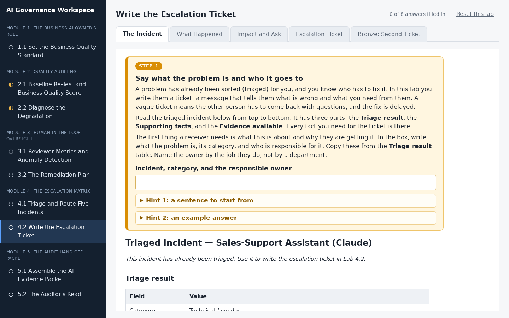
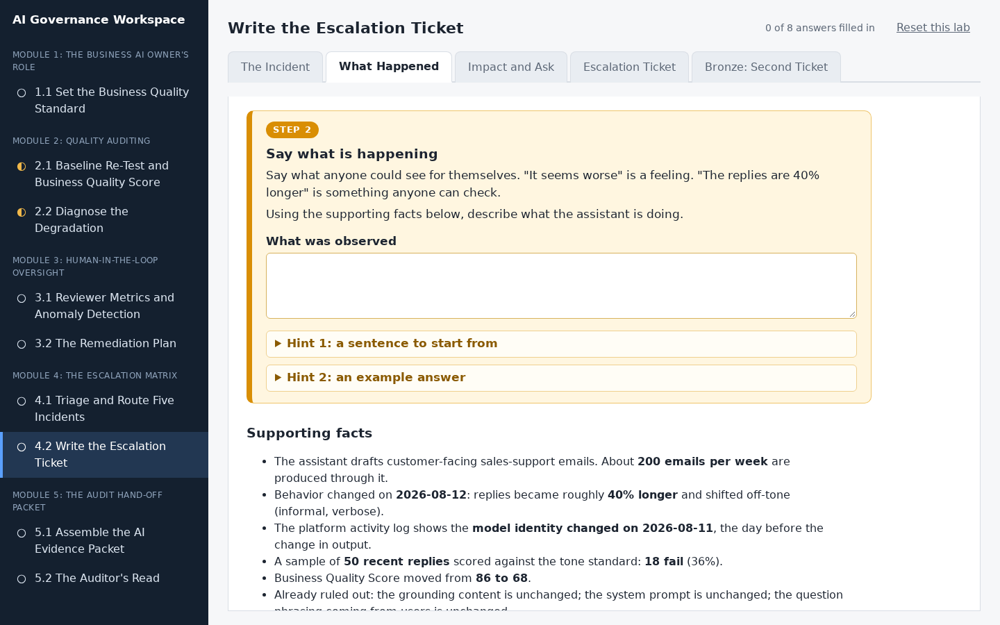
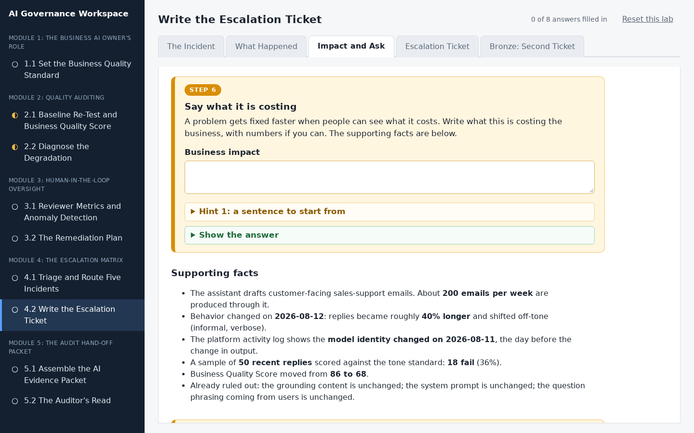
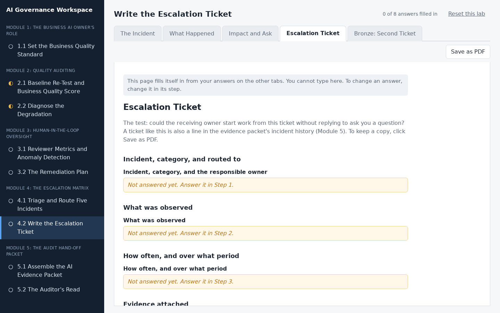
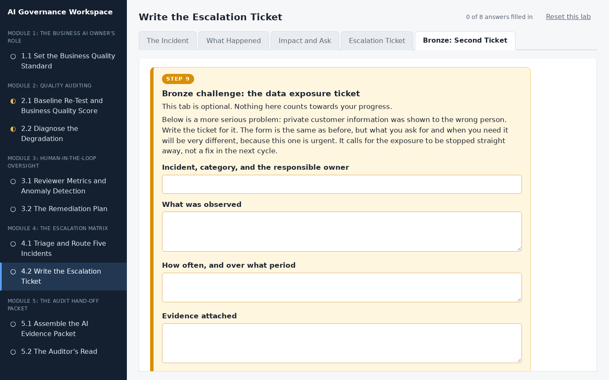

# Write the Escalation Ticket

## Lab Objective

**Write an escalation ticket that gives a responsible owner everything they need to act.**

Escalations fail in practice by describing a feeling instead of a frequency. "The assistant seems worse" is not a ticket. In this lab you take a fully triaged incident and write the handoff a responsible owner actually needs: what was observed, how often, over what period, what evidence is attached, what it is costing the business, and the specific action you are asking for.

In this lab, you will:
- Convert a triaged incident into an escalation ticket
- State observations as behavior and frequency, not impression
- Name the evidence and what you have already ruled out
- Set a response-by expectation aligned to urgency

By the end of this lab you will be able to write an escalation an owner can act on without coming back to you with questions.

## In Plain Words

- **What you are doing:** A problem has already been sorted for you, and you know who has to fix it. Now you write them a message that tells them what is wrong and what you need from them.
- **Why it matters:** If your message is vague, the other person has to come back with questions, and the fix is delayed. A good message means they can start work straight away.
- **You do not have to:** download anything, open a spreadsheet, or make anything up. Every fact you need is on the first tab, and everything you type saves by itself.
- **If you feel lost:** in the workspace, every instruction is in a numbered orange box. Do the boxes in order, from the left-most tab to the right-most tab.

**Words you will see in this lab**
- **Ticket:** a written request that asks someone to fix something. It has fixed parts, so nothing is left out.
- **Escalation:** passing a problem to the person who can fix it.
- **Evidence:** the proof behind what you are saying, such as a count, a date, or a record.
- **Ruled out:** checked and found not to be the cause. Saying what you have ruled out saves the other person from checking it again.
- **The ask:** the one clear thing you want the other person to do.

## Resources

- If you haven't already done so, click the `WEB PORTS` dropdown in your classroom environment. From that menu click `aux1:2224`.
- On the page that opens in your browser, click `4.2 Write the Escalation Ticket` in the left sidebar.
- Then do Step 1 to Step 8 in the workspace. You do not need to keep this page open while you work.

## What You Will Do in the Workspace

Everything you do in this lab happens in the workspace.

- The workspace has four tabs. Start on the left-most tab and work to the right. You never need to go back to a tab you have finished.
- On each tab, work from top to bottom. Every instruction is in an orange box with a step number, from Step 1 to Step 8. Everything outside the orange boxes is the material you need for that step.
- If a step asks you to answer something, the answer box is inside the orange box.
- Stuck? Each orange box has hints you can open, and most have a **Show the answer** button.
- At the bottom of each tab, click **Go to the next tab** when you have finished every step on it.
- Everything you type saves by itself. The counter at the top right shows how many answers you have filled in.
<!-- challenge section
- The last tab, Bronze: Second Ticket, is optional. It does not count towards the counter.
end challenge section -->

### Tab 1: The Incident (Step 1)

You read the incident that has already been triaged for you, then write the first line of the ticket: what the problem is, its category, and who it goes to.

### Tab 2: What Happened (Steps 2 to 5)

You describe what the assistant is doing as behaviour anyone could check, how often and since when, the evidence you have, and what you have already ruled out. The facts each step needs are right under it.

### Tab 3: Impact and Ask (Steps 6 to 8)

You say what the problem is costing, the one specific thing you want the owner to do, and when you need a reply.

### Tab 4: Escalation Ticket

You do not type anything here. This tab gathers your answers into the finished ticket. Anything you missed says which step to go back to. Click **Save as PDF** if you want a copy.

<!-- challenge section
### Tab 5: Bronze: Second Ticket (optional, Step 9)

An extra challenge for anyone who finishes early: write the ticket for a more serious incident, where private customer information was shown to the wrong person.
end challenge section -->

## Conclusion

In this lab you wrote an escalation ticket that gives the responsible owner the observation, frequency, period, evidence, impact, a specific ask, and a response-by date. That ticket is also a line in the audit packet's incident history.
