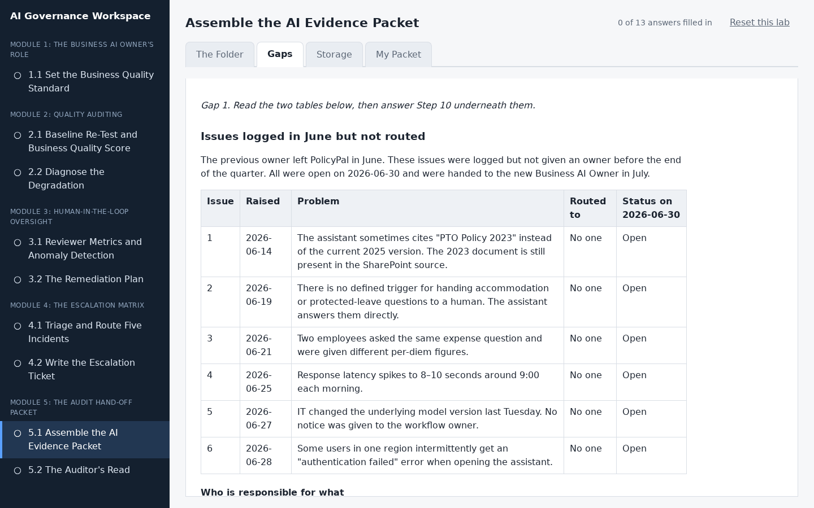
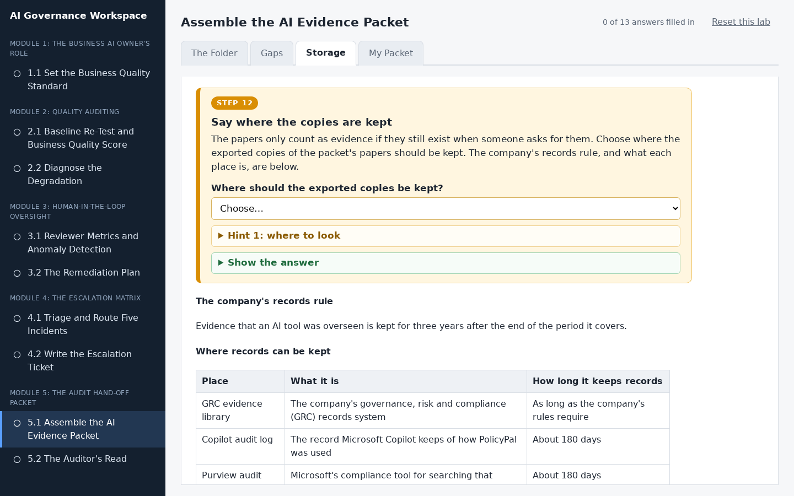
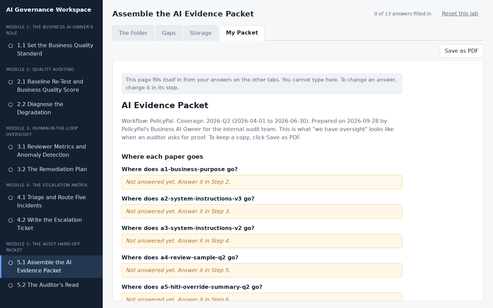

# Assemble the AI Evidence Packet

## Lab Objective

**Build a six-section evidence packet for one quarter from a folder of candidate papers, list its gaps and who will fill them, and choose where the copies are kept.**

This is the capstone. When an auditor asks you to show that oversight of an AI workflow actually happened, the answer is a packet: business purpose, system instructions and rules, sampled review records and scores, the override summary and reviewer audit, incident history, and the change-control log. Internal audit has asked for PolicyPal's packet for Q2 2026, the quarter before you took it over. You get a folder with more papers than the packet needs, including a newer version of the rules and another tool's quality record. You decide what belongs, find what is missing, say who will supply it, and keep the copies somewhere they will last.

In this lab, you will:
- Sort candidate papers into the six packet sections, keeping only papers about this workflow and this quarter
- Choose the version of a document that was in force during the period, even when a newer one exists
- Check whether each section's evidence covers the whole period
- Name who can supply each missing piece of evidence
- Choose a place to keep the copies that outlasts the AI platform's own records

By the end of this lab you will be able to assemble an audit-ready evidence packet for any AI workflow.

## In Plain Words

- **What you are doing:** Imagine an auditor is coming, and they want proof that the company really kept an eye on PolicyPal. You have a folder of eight papers from the quarter before you took PolicyPal over. You will put each one in the right section of a packet or leave it out, and list anything that is missing.
- **Why it matters:** "We looked after it" is not proof. Papers are. A packet with the right papers in the right places is what lets a company pass an audit.
- **You do not have to:** download anything, open a spreadsheet, or type anything. Each step shows the papers it needs, and every answer is a drop-down menu or a list of boxes to tick.
- **If you feel lost:** in the workspace, every instruction is in a numbered orange box. Do the boxes in order, from the left-most tab to the right-most tab.

**Words you will see in this lab**
- **Auditor:** a person whose job is to check that a company really did what it says it did.
- **Evidence packet:** a set of papers, organised into sections, that proves the company kept watch over its AI.
- **Coverage period:** the stretch of time a packet or paper proves something about. For example, "2026-Q2" means 2026-04-01 to 2026-06-30.
- **Retention:** where the company keeps its records, and for how long. A record kept only on the AI platform can be deleted by the platform after about 180 days, so it must also be kept somewhere else.
- **Gap:** something that should be in the packet but is missing.
- **Superseded:** replaced by a newer version. A superseded paper can still be the right one for a packet about the time before it was replaced.
- **In force:** the version of a rule or document that applied at the time.

## Resources

- If you haven't already done so, click the `WEB PORTS` dropdown in your classroom environment. From that menu click `aux1:2224`.
- On the page that opens in your browser, click `5.1 Assemble the AI Evidence Packet` in the left sidebar.
- Then do Step 1 to Step 12 in the workspace. You do not need to keep this page open while you work.

## What You Will Do in the Workspace

Everything you do in this lab happens in the workspace.

- The workspace has four tabs. Start on the left-most tab and work to the right. You never need to go back to a tab you have finished.
- On each tab, work from top to bottom. Every instruction is in an orange box with a step number, from Step 1 to Step 12. Everything outside the orange boxes is the material you need. On the first two tabs, the material comes first and the box that asks about it is right underneath.
- If a step asks you to answer something, the answer box is inside the orange box.
- Stuck? Most orange boxes have a hint you can open, and each question has a **Show the answer** button.
- At the bottom of each tab, click **Go to the next tab** when you have finished every step on it.
- Every answer is a drop-down menu or a list of boxes to tick. Everything saves by itself. The counter at the top right shows how many answers you have filled in.

### Tab 1: The Folder (Steps 1 to 9)

Step 1 says what the auditor has asked for and lists the six sections of the packet. Then you see the eight papers one at a time, and under each one you choose its section, or leave it out. A paper belongs only if it is about PolicyPal and is evidence for Q2.

### Tab 2: Gaps (Steps 10 and 11)

Two gaps, one step each, with what you need to read right above it. You decide what the missing change record for section 6 should show, check whether the reviewer summary in section 4 covers the whole quarter, and choose who can supply each missing piece.

### Tab 3: Storage (Step 12)

You choose where the copies are kept so they last as long as the company's records rule requires.

### Tab 4: My Packet

You do not type anything here. This tab gathers your answers into the finished packet. Anything you missed says which step to go back to. Click **Save as PDF** if you want a copy.

## Conclusion

In this lab you assembled PolicyPal's Q2 evidence packet from a folder of real and decoy papers. You kept the rules that were in force in Q2 rather than the newest ones, left out another tool's quality record, listed the two gaps with who can supply each, and chose a place to keep the copies that outlasts the platform's 180 days. That packet is what "we have oversight" looks like when an auditor asks for proof. What you carry to your own workflows is the test for each paper (this workflow, this period) and the habit of listing your own gaps.
