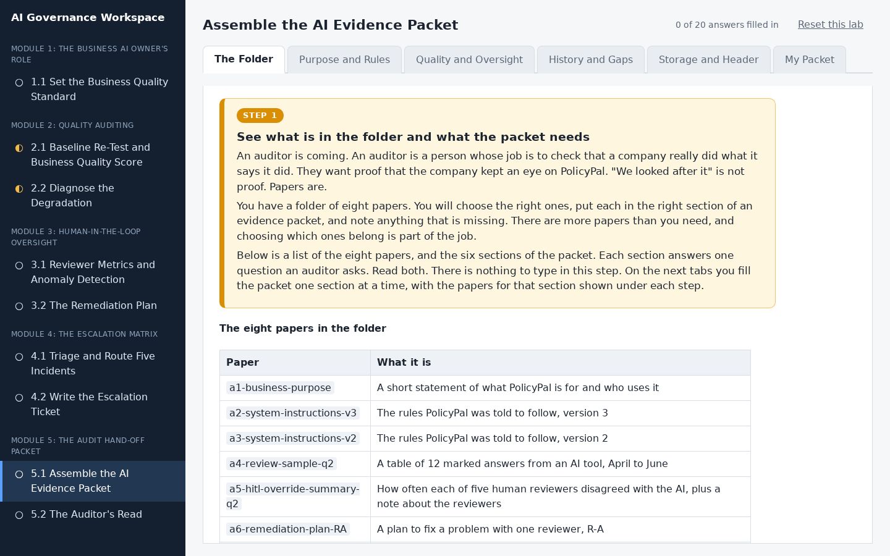
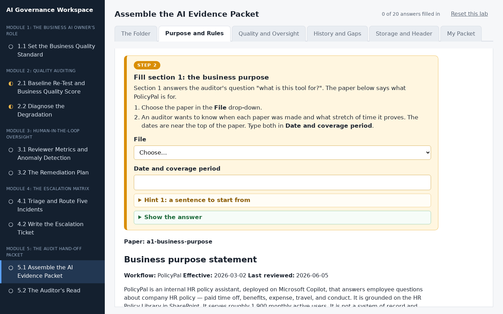
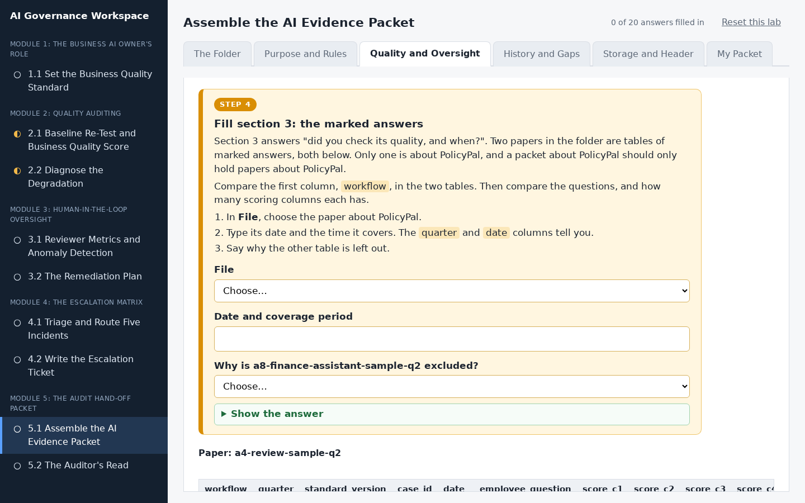
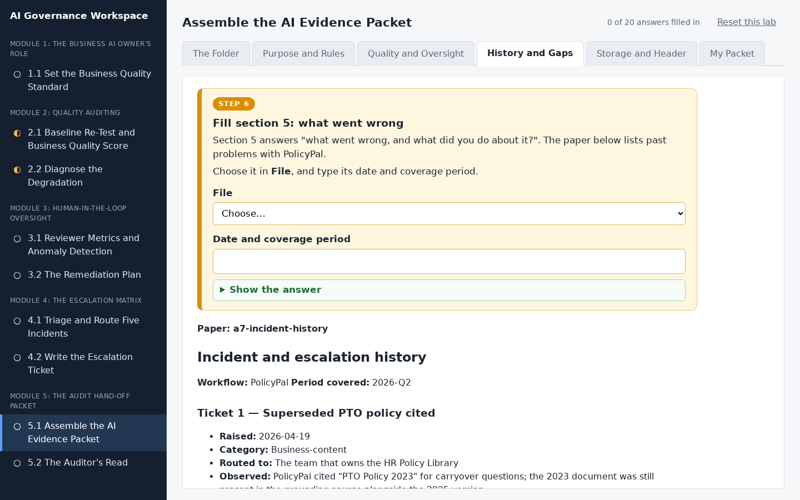
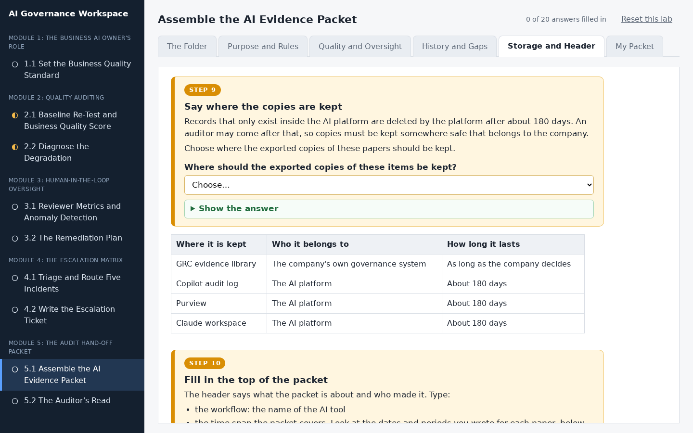
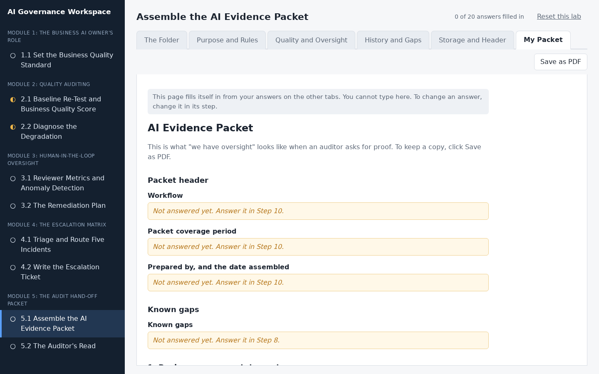

# Assemble the AI Evidence Packet

## Lab Objective

**Build a six-section evidence packet from a folder of candidate artifacts, identify what is missing, and record where each item is retained and for how long.**

This is the capstone. When an auditor asks you to show that oversight of an AI workflow actually happened, the answer is a packet: business purpose, system instructions and rules, sampled review records and scores, the override summary and reviewer audit, incident history, and the change-control log. In this lab you are given a folder with more artifacts than the packet needs, including a near-duplicate and one from a different workflow, plus a six-section packet form. You map what belongs, exclude what does not, name the gap, and complete the index.

In this lab, you will:
- Map candidate artifacts to the six packet sections
- Resolve a superseded near-duplicate by effective date
- Exclude an artifact that belongs to a different workflow, and say how you knew
- Identify a missing packet component and name who owns producing it
- Record a date, coverage period, and retention location for the packet

By the end of this lab you will be able to assemble an audit-ready evidence packet for any AI workflow.

## In Plain Words

- **What you are doing:** Imagine an auditor is coming, and they want proof that the company really kept an eye on PolicyPal. You have a folder of eight papers. You will choose the right ones, put each in the right place in a packet, and note anything that is missing.
- **Why it matters:** "We looked after it" is not proof. Papers are. A packet with the right papers in the right places is what lets a company pass an audit.
- **You do not have to:** download anything, open a spreadsheet, or type long answers. Each step shows the papers it needs, and nearly everything else is a drop-down menu.
- **If you feel lost:** in the workspace, every instruction is in a numbered orange box. Do the boxes in order, from the left-most tab to the right-most tab.

**Words you will see in this lab**
- **Auditor:** a person whose job is to check that a company really did what it says it did.
- **Evidence packet:** a set of papers, organised into sections, that proves the company kept watch over its AI.
- **Coverage period:** the stretch of time a paper proves something about. For example, "2026-Q2" means April to June 2026.
- **Retention:** where the company keeps its records, and for how long. A record kept only on the AI platform can be deleted by the platform after about 180 days, so it must also be kept somewhere else.
- **Gap:** something that should be in the packet but is missing.
- **Superseded:** replaced by a newer version.

## Resources

- If you haven't already done so, click the `WEB PORTS` dropdown in your classroom environment. From that menu click `aux1:2224`.
- On the page that opens in your browser, click `5.1 Assemble the AI Evidence Packet` in the left sidebar.
- Then do Step 1 to Step 10 in the workspace. You do not need to keep this page open while you work.

## What You Will Do in the Workspace

Everything you do in this lab happens in the workspace.

- The workspace has six tabs. Start on the left-most tab and work to the right. You never need to go back to a tab you have finished.
- On each tab, work from top to bottom. Every instruction is in an orange box with a step number, from Step 1 to Step 10. Everything outside the orange boxes is the material you need for that step.
- If a step asks you to answer something, the answer box is inside the orange box.
- Stuck? Each orange box has hints you can open, and most have a **Show the answer** button.
- At the bottom of each tab, click **Go to the next tab** when you have finished every step on it.
- Most answers are drop-down menus. Everything you type or pick saves by itself. The counter at the top right shows how many answers you have filled in.

### Tab 1: The Folder (Step 1)

You see the eight papers in the folder and the six sections of the packet, each of which answers one question an auditor asks.

### Tab 2: Purpose and Rules (Steps 2 and 3)

You fill sections 1 and 2. Each step shows the papers it is about right under it. For section 2 you choose between two versions of PolicyPal's rules, using their dates.

### Tab 3: Quality and Oversight (Steps 4 and 5)

You fill sections 3 and 4. For section 3 you spot the table of marked answers that belongs to a different AI tool and leave it out.

### Tab 4: History and Gaps (Steps 6 to 8)

You fill section 5, check whether the folder has a paper for section 6, and write down the gap, with who will fix it and by when.

### Tab 5: Storage and Header (Steps 9 and 10)

You choose where the copies are kept so they outlast the platform's 180-day limit, then fill in the top of the packet.

### Tab 6: My Packet

You do not type anything here. This tab gathers your answers into the finished evidence packet. Anything you missed says which step to go back to. Click **Save as PDF** if you want a copy.

## Conclusion

In this lab you assembled a six-section evidence packet from a folder of real and decoy artifacts, identified a missing component and named who owns it, excluded evidence from another workflow, and recorded where the packet is retained and for how long. That packet is what "we have oversight" looks like when an auditor asks for proof. You built one here from a supplied folder with the structure given; what you carry to your own workflows is the packet structure and the retention notes, not this single assembled example.
