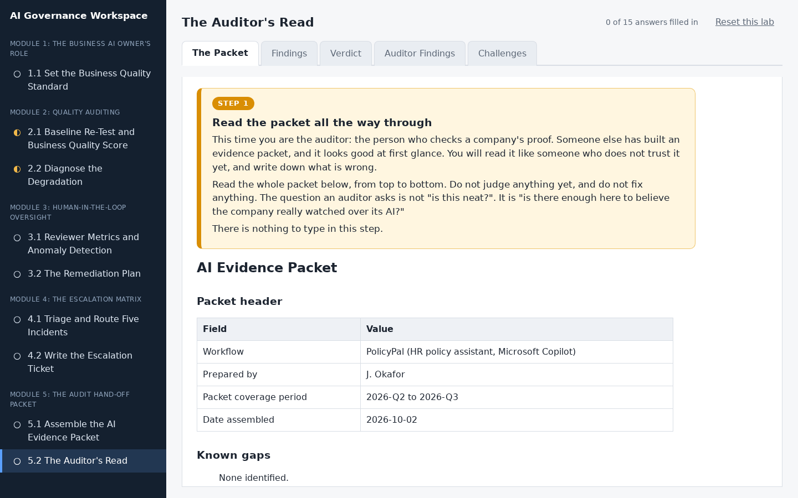
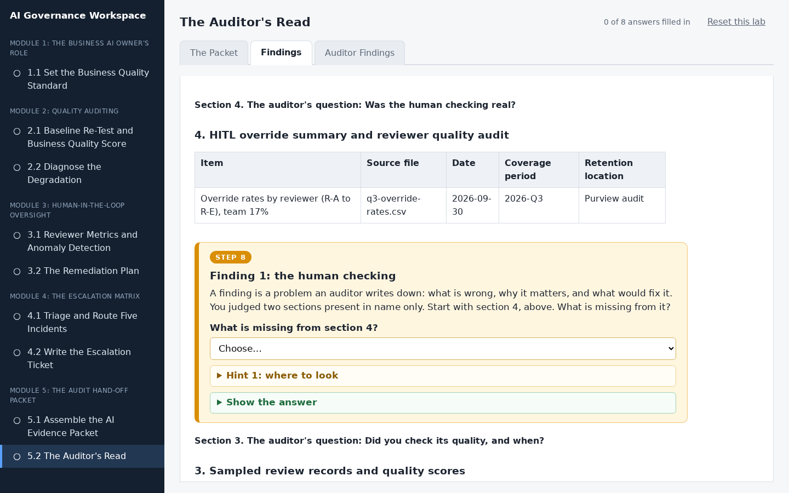
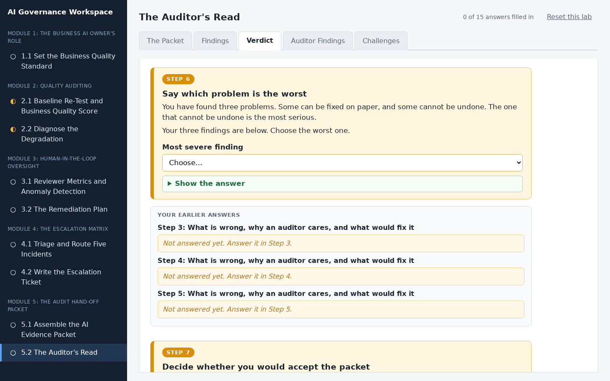
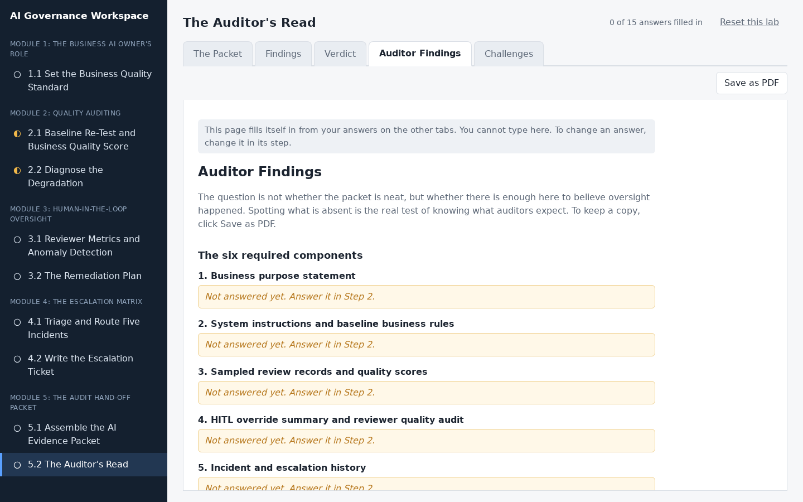
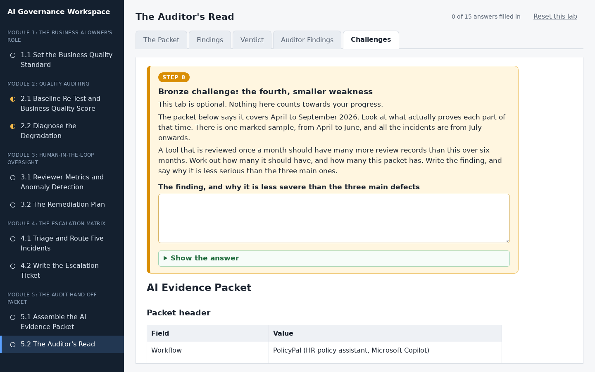

# The Auditor's Read

## Lab Objective

**Read an evidence packet the way an auditor would and write up its defects, ranked by severity.**

Knowing what auditors expect is tested by whether you can spot its absence, not by whether you can recite the list. In this lab a colleague has drafted PolicyPal's evidence packet for Q3 2026, the quarter you have run it since Lab 1.1, and you read it the way internal audit will before it goes to them. It looks competent, and most of it is right. It has three real defects: a section that is there in name only, quality scores that cannot be interpreted, and evidence kept in places that will delete it long before the records rule allows. You find them, explain why each one matters to an auditor, say what would fix it, rank them, and decide whether the packet is ready.

In this lab, you will:
- Check a packet section by section against the six required components
- Identify a component present in name only, uninterpretable scores, and a retention failure
- Explain why platform-only retention fails a three-year records rule
- Write three findings and rank them by severity

By the end of this lab you will be able to review an AI evidence packet against what an auditor actually needs.

## In Plain Words

- **What you are doing:** A colleague has built PolicyPal's evidence packet for the last three months, and it looks good at first glance. Before it goes to the auditors, you read it the way they will, like someone who does not trust it yet, and write down what is wrong.
- **Why it matters:** The best way to learn what a good packet needs is to spot what a bad one is missing. Noticing what is absent is much harder than noticing what is there.
- **You do not have to:** download anything, open a spreadsheet, or fix the packet. You only read it and write down the problems. Most answers are drop-down menus or boxes to tick, and everything saves by itself.
- **If you feel lost:** in the workspace, every instruction is in a numbered orange box. Do the boxes in order, from the left-most tab to the right-most tab.

**Words you will see in this lab**
- **Auditor:** a person whose job is to check that a company really did what it says it did.
- **Finding:** a problem that an auditor writes down. A good finding says what is wrong, why it matters, and what would fix it.
- **Severity:** how serious a problem is. You rank your findings from the worst to the least bad.
- **Retention:** where the company keeps its records, and for how long.
- **Quality standard:** the rulebook that a quality score was marked against. A score means nothing without it.

## Resources

- If you haven't already done so, click the `WEB PORTS` dropdown in your classroom environment. From that menu click `aux1:2224`.
- On the page that opens in your browser, click `5.2 The Auditor's Read` in the left sidebar.
- Then do Step 1 to Step 6 in the workspace. You do not need to keep this page open while you work.

## What You Will Do in the Workspace

Everything you do in this lab happens in the workspace.

- The workspace has four tabs. Start on the left-most tab and work to the right. You never need to go back to a tab you have finished.
- On each tab, work from top to bottom. Every instruction is in an orange box with a step number, from Step 1 to Step 6. Everything outside the orange boxes is the material you need for that step.
- If a step asks you to answer something, the answer box is inside the orange box.
- Stuck? Each orange box has a hint you can open, and a **Show the answer** button.
- At the bottom of each tab, click **Go to the next tab** when you have finished every step on it.
- Most answers are drop-down menus or boxes to tick, plus a few short lines you write. Everything saves by itself. The counter at the top right shows how many answers you have filled in.
<!-- challenge section
- The last tab, Challenges, is optional. It does not count towards the counter.
end challenge section -->

### Tab 1: The Packet (Step 1)

You read the draft Q3 packet the way an auditor would, and check each of its six sections: is it there in substance, there in name only, or missing? You know what happened in Q3 from the earlier labs, so you can tell whether each section tells the whole story.

### Tab 2: Findings (Steps 2 to 4)

You write three findings, one per step, each with the part of the packet it is about shown right under it. For each one you choose what is wrong, or tick the rows it affects, then write why an auditor would care and what would fix it.

### Tab 3: Verdict (Steps 5 and 6)

You pick the most serious finding, and decide whether the packet is ready to send to the auditors.

### Tab 4: Auditor Findings

You do not type anything here. This tab gathers your answers into your findings. Anything you missed says which step to go back to. Click **Save as PDF** if you want a copy.

<!-- challenge section
### Tab 5: Challenges (optional, Steps 7 to 9)

Three extra challenges for anyone who finishes early:

- **Bronze:** find a fourth, smaller weakness in the packet's time coverage.
- **Silver:** match each finding to a packet section and to the auditor's question it fails to answer.
- **Gold:** rewrite your findings as a one-page memo from an auditor.
end challenge section -->

## Conclusion

In this lab you read PolicyPal's Q3 evidence packet the way an auditor would. You found a section present in name only, quality scores that cannot be read without the standard they were marked against, and evidence kept where it will be deleted long before the three-year records rule allows, and you ranked the one that cannot be put right later as the most serious. Spotting what is absent is the real test of knowing what auditors expect.
